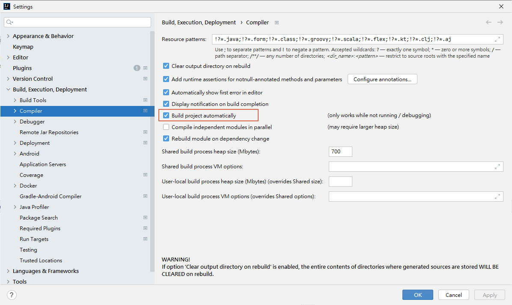
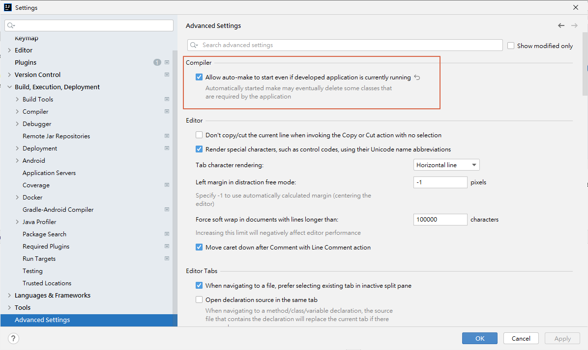

#### 1) In IntellijIDEA: go in settings(ctrl +alt+s) -> Build,Execution,Deployment -> compiler, check "Build project automatically"

#### 2) Enable option 'allow auto-make to start even if developed application is currently running' in Settings -> Advanced Settings under compiler

